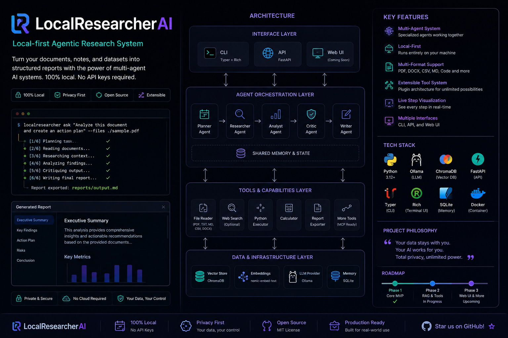

# 🔬 LocalResearcherAI

Don't just ask AI. Understand why it answered.  
Private by default. Transparent by design.

  

A local-first, transparent AI research assistant that analyzes documents on your own machine using local LLMs.

Your documents never leave your computer.

Python 3.12+
License: MIT
Code style: black

---

## ✨ Why LocalResearcherAI?

- 🔒 100% Local Processing — no API keys, no cloud, no data sharing
- 🧠 Multi-Agent Research Pipeline — Planner, Researcher, Analyst, Critic and Writer agents
- 📄 RAG-Powered Document Analysis — extract insights from your own files
- 🔍 Knowledge vs Evidence Modes — clear separation between model knowledge and document-backed analysis
- ⚠️ Honest Limitations — never pretends to have sources it does not have
- 📝 Markdown Reports — structured, readable and easy to export

---

## 🎯 Why This Project?

Most AI tools give you answers without showing where the answer came from.

LocalResearcherAI focuses on a simple principle:

> Every answer should make clear what it is based on.

If no documents are provided, it uses local model knowledge and clearly labels the response as unverified.  
If documents are provided, it switches into evidence mode and analyzes the supplied files locally.

---

## ✅ What Works Today

| Feature | Status | Notes |
|---|---:|---|
| Local-first execution | ✅ Ready | Runs with Ollama locally |
| Document analysis | ✅ Ready | PDF, Markdown and TXT support |
| Multi-agent pipeline | ✅ Ready | 5 specialized agents |
| Intent detection | ✅ Ready | Routes greeting, small talk and research queries |
| Knowledge Mode | ✅ Ready | Uses local model knowledge only |
| Evidence Mode | ✅ Ready | Uses provided documents with RAG |
| Transparent limitations | ✅ Ready | Clearly states missing sources/citations |
| Explainable workflows | 🚧 In Progress | Step-by-step execution visibility |
| Evidence attribution | 📅 Planned | Phase 2 |
| Per-claim confidence | 📅 Planned | Phase 2 |
| Web search | 📅 Planned | Future phase |

Legend: ✅ Ready | 🚧 In Progress | 📅 Planned

---

## ⚡ Quick Start

bash # 1. Clone and install git clone https://github.com/serkannkara/LocalResearcherAIAgent.git cd LocalResearcherAIAgent ./install.sh  # 2. Pull local models ollama pull qwen2.5:latest ollama pull nomic-embed-text:latest  # 3. Try local knowledge mode localresearcher ask "What is Agentic AI?" 

To analyze your own document:

bash localresearcher ask "Summarize this document and extract key insights." --files ./your-document.md 

Execution time depends on your hardware, model size and document length.

---

## 🎬 How It Works

### Two Modes: Knowledge vs Evidence

| Mode | Source | Confidence | Best For |
|---|---|---:|---|
| 🧠 Knowledge Mode | Local model knowledge | Low | Quick explanations |
| 🔬 Evidence Mode | Your documents | Medium-High | Document-backed analysis |

---

### 🧠 Knowledge Mode

Used when no files are provided.

bash localresearcher ask "What is Agentic AI?" 

LocalResearcherAI clearly states:

text No documents provided. No web search available. No external evidence. This is an AI-generated explanation, not verified research. 

---

### 🔬 Evidence Mode

Used when files are provided.

bash localresearcher ask "Summarize findings" --files report.pdf 

Multiple files can be passed by repeating --files:

bash localresearcher ask "Compare these reports" --files Q1.pdf --files Q2.pdf 

Glob patterns are also supported:

bash localresearcher ask "Analyze all notes" --files "./documents/*.md" 

Repository-level analysis is planned for a future phase.  
For now, use --files for document analysis.

---

## 🏗️ Architecture

LocalResearcherAI uses a sequential 5-agent workflow coordinated through a central workflow state.

text User Query    │    ▼ Intent Classifier    │    ├── Greeting / Small Talk ──► Quick Reply    │    └── Research           │           ▼    Workflow State Manager           │           ▼ Planner → Researcher → Analyst → Critic → Writer           │           ▼    RAG Layer    ├── Document Loader    ├── Chunker    ├── Embeddings    └── Vector Store           │           ▼       Ollama / Qwen           │           ▼    Markdown Report 

---

## 🤖 Agent Pipeline

### 1. Planner Agent
Breaks the user query into a structured research plan.

### 2. Researcher Agent
Gathers relevant information from documents or local model knowledge.

### 3. Analyst Agent
Synthesizes findings, identifies patterns and structures the analysis.

### 4. Critic Agent
Reviews the analysis for gaps, weak reasoning and missing perspectives.

### 5. Writer Agent
Generates the final markdown report.

---

## 🧠 Workflow State

The workflow state is the single source of truth during execution.

text WorkflowState │ ├─ Task │  └─ Original query + documents │ ├─ Current Step │  └─ Planning / Research / Analysis / Critique / Writing │ ├─ Planner Output ├─ Research Findings ├─ Analysis ├─ Critique ├─ Final Report │ └─ Agent Outputs    └─ Complete audit trail 

This enables transparency, debugging and future replay/export features.

---

## 🧱 Technology Stack

| Layer | Technology |
|---|---|
| CLI | Typer + Rich |
| LLM | Ollama |
| Default model | qwen2.5 |
| Embeddings | nomic-embed-text |
| Vector DB | ChromaDB |
| Document loading | pypdf, Markdown, TXT |
| Reports | Markdown |

---

## 📊 Performance

Tested locally on Apple Silicon.

| Task | Typical Time |
|---|---:|
| Intent detection | < 0.5s |
| Document loading | 1-2s |
| Vector retrieval | < 300ms |
| Full multi-agent run | seconds to tens of seconds |

Results vary depending on hardware, model size and document length.

---

## 🌟 What Makes It Different?

### Transparency First

LocalResearcherAI does not pretend to have evidence it does not have.

Knowledge Mode says:

text No external documents. No web search. No citations. Information may be outdated. Confidence: LOW. 

Evidence Mode says:

text Documents analyzed. RAG retrieval used. Document-backed response. Confidence: MEDIUM-HIGH. 

This honesty is the core of the project.

---

## 🚀 Future: Explainability Engine

Planned for Phase 2:

markdown ## Conclusion  Local AI adoption is accelerating.  ## Evidence  1. Source: market-report.pdf, page 12    Confidence: 95%  2. Source: industry-blog.md    Confidence: 67%  ## Reasoning Chain  1. Identified theme across documents 2. Cross-referenced supporting evidence 3. Checked for contradictions 4. Weighted by source reliability 

This is not fully available yet. It is part of the roadmap.

---

## 🎯 Roadmap

| Phase | Focus | Status |
|---|---|---|
| Phase 1 | Local multi-agent MVP | ✅ Complete |
| Phase 2 | Evidence attribution + confidence | 📅 Planned |
| Phase 3 | Enhanced RAG + memory | 📅 Planned |
| Phase 4 | Web UI + workspaces | 📅 Future |
| Phase 5 | Web search integration | 📅 Future |
| Phase 6 | MCP ecosystem | 📅 Vision |

See ROADMAP_PRAGMATIC.md for details.

---

## 🏆 Use Cases

### Academic Research

bash localresearcher ask "Summarize these papers" --files paper1.pdf --files paper2.pdf 

### Business Analysis

bash localresearcher ask "Analyze this quarterly report" --files Q1.pdf 

### Legal Review

bash localresearcher ask "Identify key risks in this contract" --files contract.pdf 

### Personal Knowledge Management

bash localresearcher ask "Summarize my notes" --files "./notes/*.md" 

---

## 🚀 Earning “ResearchOS”

We do not call this ResearchOS yet.

That name is earned, not claimed.

Current: LocalResearcherAI  
Transparent local document research.

Future: ResearchOS  
An operating system for knowledge work.

How we earn it:

- Build trust through transparency
- Deliver explainability at scale
- Add persistent workspaces
- Create plugin and MCP ecosystem
- Prove value with real users

Until then:

Stay focused. Build trust. Deliver value.

---

## 🎤 One-Line Pitch

Local-first, transparent AI research. Know why, not just what.

---

## 📖 Documentation

- Quick Start
- Architecture
- Roadmap
- Contributing
- Vision

---

## 🤝 Contributing

Contributions are welcome.

Good first issues:

- Add new document format loaders
- Improve error messages
- Add tests
- Write tutorials
- Improve examples

---

## 📄 License

MIT License. See LICENSE for details.

---

## 🙏 Acknowledgments

Built with:

- Ollama — local LLM inference
- ChromaDB — vector database
- Typer — CLI framework
- Rich — terminal UI

---

Made with ❤️ by Serkan Kara

⭐ Star the project if you find it usefu
